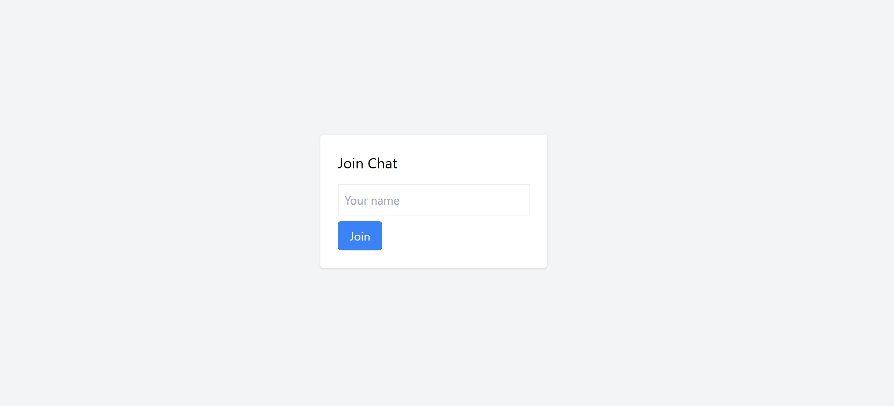
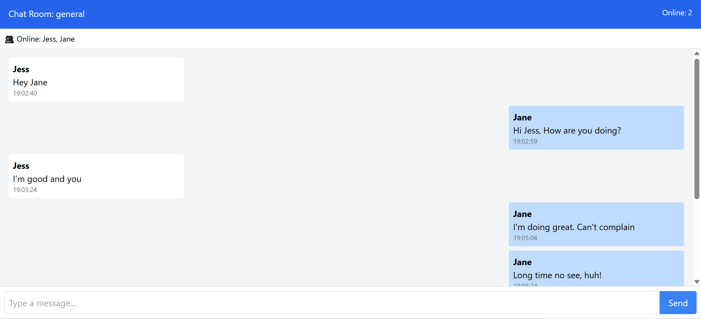

# Real-Time Chat Application with Socket.io

A fully functional real-time chat application built with the **MERN stack** and **Socket.io**, enabling bidirectional communication between clients and server with live messaging, user presence, and advanced collaboration features.

## 🚀 Features Implemented

### ✅ Core Chat Functionality (Task 2)
- **Username-based authentication** — users join with a display name
- **Global chat room** — all connected users receive messages in real time
- Messages display **sender name** and **timestamp**
- **Online/offline user status** — live updates when users join or leave
- **Typing indicators** — shows “X is typing…” when a user is composing a message

### ✅ Advanced Chat Features (Task 3) – *3+ Implemented*
- ✅ **Multiple chat rooms** (default: "general"; logic supports room switching)
- ✅ **Private messaging** — send direct messages to specific online users
- ✅ **Read receipts** — messages show “✓ Read” once viewed by the recipient

### ✅ Real-Time Notifications (Task 4)
- Audio alert on new message (HTML5 sound)
- Notifications when users **join** or **leave** the chat room
- Visual feedback for message delivery and read status

### ✅ Performance & UX Optimization (Task 5)
- **Fully responsive design** — works seamlessly on mobile, tablet, and desktop (built with Tailwind CSS)
- **Automatic reconnection** if connection drops
- **Room-based message history** loaded on join
- Clean, intuitive UI with real-time updates and error resilience

## 🛠️ Tech Stack
- **Frontend**: React, Vite, Tailwind CSS, socket.io-client
- **Backend**: Node.js, Express, Socket.io
- **Real-Time Engine**: WebSocket (via Socket.io)
- **Deployment**: 
  - Frontend → Vercel  
  - Backend → Railway

## ▶️ Local Setup

### Prerequisites
- Node.js v18 or higher
- npm

### Installation

1. Clone the repository:
   ```bash
   git clone https://github.com/your-username/real-time-communication-with-socket-io-Jess-neemo.git
   cd real-time-communication-with-socket-io-Jess-neemo

2. Install backend dependencies
    bash
    cd server

3. Install frontend dependencies
    bash
    cd client
    npm install

Running the 

Open two terminal windows:

Terminal 1 – Start the backend server:    
   bash
   cd server
   npm run dev
   # Server rund on http://localhost:3001

Running the Application
Open two terminal windows:

Terminal 2 – Start the frontend app:
   bash
   cd client
   # App available at http://localhost:
   

🌐 Deployment

Frontend: https://your-chat-app.vercel.app
Backend: https://your-socket-server.up.railway.app


📸 Screenshots

Join Screen



Real-Time Chat Interface



📁 Project Structure

real-time-communication-with-socket-io-Jess-neemo/
├── client/                 
│   ├── public/
│   ├── src/
│   │   ├── socket/         
│   │   └── App.jsx         
├── server/                 
│   └── server.js          
├── screenshots/            
├── README.md
└── Week5-Assignment.md